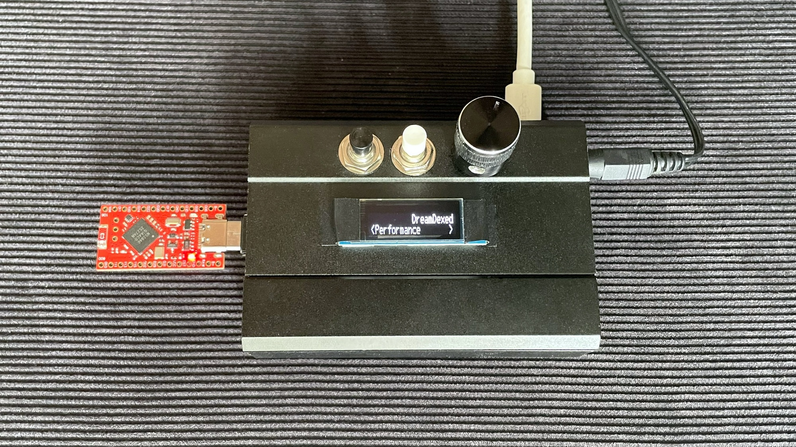
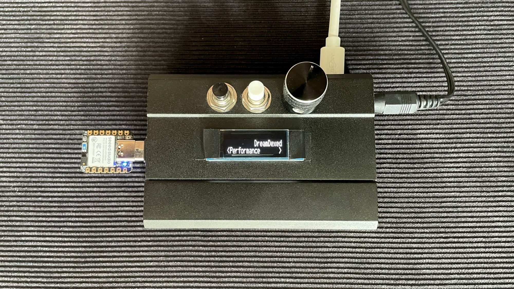

# Bluetooth MIDI Host - nRF52840 

// BLE MIDI Central (aka host) Bridge //

Connect a low-cost nRF52840 micro-controller to a MIDI device via USB or 5-Pin DIN - and it automatically pairs 
with the first BLE MIDI device that it scans! 

_Description:_

Connects to a BLE MIDI peripheral as a **central**, pairs with it, and forwards
all incoming MIDI to both **USB MIDI** (class-compliant) and **serial MIDI**
(DIN-5 / TRS via an optocoupler at 31250 baud). 

Bonus: When no BLE peripheral is connected, the bridge instead acts as a
bidirectional USB <-> serial MIDI interface (USB in -> serial out, and serial
in -> USB out). This USB/serial bridging is automatically disabled while BLE is
connected, so it can't echo or interfere with the BLE MIDI stream.

Target board: **SuperMini / ProMicro nRF52840** (Nice!Nano-compatible clone, $3 on aliexpress)

The same code also runs on the Seeed XIAO nRF52840, nice!nano v2, and Nordic DK with
only the pin defines changed (see "Other boards" below).

Here are pics of a SuperMini and Seeed XIAO nrf connected to a Raspberry Pi 3b running DreamDexed (Minidexed fork):



## Why BLE central + pairing?

Instantly connect any BLE MIDI controller to any MIDI device.

Most BLE MIDI sources are peripherals, and many of them (following the Apple BLE
MIDI conventions) refuse to enable notifications until the link is **paired**.
Phones and computers pair automatically; this firmware does the same with a
"just works" pairing so the peripheral actually starts streaming MIDI.

Use case: I created a getural MIDI glove and wanted to be able to control any synth
without needing a PC or smartphone to pair with and forward midi. More info here:

[Sneaky Gestures V2: Glove MIDI Controller](https://github.com/sneak-thief/Sneaky-Gestures-V2)


## 1. Install the board support package (BSP)

The SuperMini / ProMicro nRF52840 clones are best supported by **Patrick Cook's
nRFMicro-Arduino-Core** (https://github.com/pdcook/nRFMicro-Arduino-Core), an
Adafruit-nRF52 fork built for these clones. Because it is an Adafruit fork, it
ships the **Bluefruit** library this sketch needs.

> Note: "SuperMini nRF52840" and "ProMicro nRF52840" are the same board — it was
> renamed around September 2023.

Steps (Arduino IDE 2.x):

1. File > Preferences.
2. Next to "Additional boards manager URLs", click the icon to open the list.
3. Add both of these lines:

   ```
   https://files.seeedstudio.com/arduino/package_seeeduino_boards_index.json
   https://raw.githubusercontent.com/pdcook/nRFMicro-Arduino-Core/3dab6477754d9b28053fe36b06c718cde6e93d3f/package_nRFMicro_index.json
   ```

   The second URL is **pinned to a specific commit on purpose**: the current
   `main` index has a known bug that prevents installation on Arduino IDE 2.x
   (see nRFMicro-Arduino-Core issue #1). The pinned commit installs cleanly.
   Once that issue is resolved upstream you can switch back to the `main` URL:
   `https://raw.githubusercontent.com/pdcook/nRFMicro-Arduino-Core/main/package_nRFMicro_index.json`

4. Click OK, then restart the Arduino IDE.
5. Tools > Board > Boards Manager, search **nrfmicro**, install
   **"nRFMicro-like-Boards" by pdcook**. (Restart the IDE if it doesn't appear.)
6. Tools > Board > nRFMicro-like-Boards > **SuperMini nRF52840**.
7. Set **Tools > USB Stack: TinyUSB** (required for USB MIDI).
8. Plug in the board, then pick its port from the board selector.

If the board's port doesn't appear, enter the bootloader by quickly grounding
the RST pin twice (or double-tapping RST if present); a "NICENANO" USB drive
appears when it's in bootloader mode.

### Optional: update the bootloader

These boards carry the Adafruit nRF52 bootloader and it can be updated from the
IDE: Tools > Programmer > "Bootloader DFU for Bluefruit nRF52", then
Tools > Burn Bootloader. Do not disconnect mid-update or you can brick the board.

## 2. Install libraries

Library Manager: **Adafruit TinyUSB Library** and **MIDI Library**
(FortySevenEffects). Bluefruit is included with the nRFMicro core.

## 3. Wiring (SuperMini / ProMicro nRF52840)

- **Serial MIDI out:** **D1 (TX, P0.06)** -> optocoupler -> DIN-5 / TRS, 31250 baud.
- **Serial MIDI in:** **D0 (RX, P0.08)** -> 220 Ohm resistor -> DIN-5 / TRS, 31250 baud.
  (On this board D6/D7 are I2C pins, NOT serial — use D0.)
- **USB MIDI:** native USB connector (no wiring).
- **Status LED:** onboard **red** USR LED (P0.15) — solid when connected.
  
## 4. Configuration

All board-specific settings are at the top of the `.ino`:

```cpp
#define SERIAL_MIDI_PORT   Serial1       // D0 = TX (P0.06), D1 = RX (P0.08)
#define SERIAL_MIDI_BAUD   31250
#define LED_STATUS         LED_BUILTIN   // USR LED P0.15 (core renumbers it)
#define LED_ACTIVE_LOW     0             // SuperMini USR LED is ACTIVE-HIGH
```

`LED_BUILTIN` is used instead of a raw pin number because this core renumbers
pins (the P0.15 USR LED becomes Arduino pin 22). The variant marks the LED
active-HIGH (`LED_STATE_ON = 1`), so `LED_ACTIVE_LOW = 0`.

To connect to a **specific** peripheral instead of the first BLE MIDI device
found, the scanner already filters on the BLE MIDI service UUID; if several MIDI
devices are nearby, add an address/name check inside `scan_callback()` before
calling `Bluefruit.Central.connect(report)`.

## About the blinking blue LED

These boards have two onboard LEDs. The **red** LED is your software status
indicator (driven by this sketch). The **blue** LED is wired to the battery
**charge controller**, not to a GPIO — with no battery connected it flickers on
its own. That blinking is normal and not controllable in firmware; connect a
LiPo to the battery pads and it behaves as a charge indicator instead. 
**Completely irrelevant for this project**. Ignore. Cover it with tape. 

## First-run behaviour

On first connection the bridge pairs/bonds with the peripheral (one time). The
status LED turns on when connected and notifications are enabled; MIDI then
flows to USB and the DIN output. Bond keys are stored, so later reconnects are
automatic.

## Other boards

The BLE central logic, pairing, UUIDs, and MIDI parsing are board-independent.
Only board selection and the config block change.

### XIAO nRF52840 (Sense)

- Core: "Seeed nRF52 Boards" (non-mbed). Board: Seeed XIAO nRF52840. USB Stack: TinyUSB.
- Config: `SERIAL_MIDI_PORT Serial1` (D6 = TX), `LED_STATUS 12` (RGB blue),
  `LED_ACTIVE_LOW 1` (common-anode RGB).

### nice!nano v2

- Core: nRFMicro-like-Boards (same as above). Board: nice!nano.
- Config: `SERIAL_MIDI_PORT Serial1`, `LED_STATUS LED_BUILTIN`, confirm
  `LED_ACTIVE_LOW` polarity on your board.

### Nordic nRF52840 DK

- Core: Adafruit nRF52. Board: Nordic nRF52840 DK. USB Stack: TinyUSB.
- Config: `SERIAL_MIDI_PORT Serial1`, `LED_STATUS 13` (LED1 = P0.13),
  `LED_ACTIVE_LOW 1` (DK LEDs are active LOW). Confirm the DK's Serial1 pins if
  the DIN output appears on the wrong pin.
